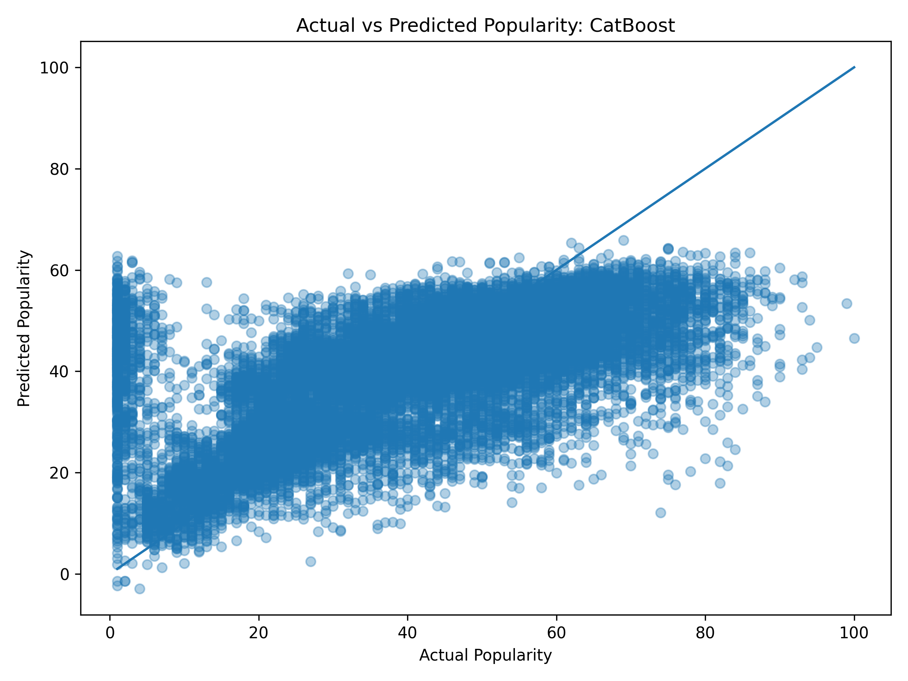

# unwrapped

**STAT 3250 Final Project — University of Virginia**

A Python package for exploring and analyzing a Spotify tracks dataset. We built
tools to clean raw Spotify data, run statistical analysis on audio features,
model track popularity, and recommend songs based on listening preferences.

## Research Questions

1. **Which audio features are most associated with track popularity?**
   We computed Pearson correlations between each audio feature and popularity,
   then used bucket analysis to check for non-linear patterns.

2. **How do genres differ in their audio profiles?**
   We compared the top genres by their average audio features to see what makes
   each genre sonically distinct.

3. **Which tracks are unusual for their genre?**
   By merging genre-level statistics back onto each track and computing
   z-scores, we identified tracks whose audio features don't match their
   genre's typical profile.

## Setup

Clone the repo and install in editable mode:

```bash
git clone https://github.com/jchardy7/unwrapped.git
cd unwrapped
pip install -e ".[dev]"
```

This installs all dependencies (pandas, numpy, matplotlib, scikit-learn) and
pytest for running the test suite.

## Running the Analysis

To run the main analysis that answers our research questions:

```bash
python scripts/demo_analysis.py
```

This cleans the raw dataset, runs the full analysis pipeline, and prints
findings for each research question with key takeaways.

### Other Demos

```bash
python scripts/demo_cleaning.py       # See what the cleaning pipeline does
python scripts/demo_validation.py     # Run data quality checks
python scripts/demo_summary.py        # Print descriptive statistics
python scripts/demo_visualization.py  # Generate charts (saved to outputs/)
```

## Running Tests

```bash
pytest
```

Tests are in the `tests/` directory. They use small hand-built DataFrames so
they run fast and don't need the real CSV file.

## Project Structure

```
unwrapped/
├── data/raw/               # Raw Spotify dataset
├── scripts/                # Demo scripts for each workflow
│   ├── demo_analysis.py    # Main analysis (research questions)
│   ├── demo_cleaning.py    # Cleaning pipeline demo
│   ├── demo_json_loading.py  # JSON loading demo
│   ├── demo_summary.py     # Descriptive statistics demo
│   ├── demo_validation.py  # Data quality checks demo
│   └── demo_visualization.py  # Chart generation
├── group3_model_comparison.py  # Compares Linear Regression, Random Forest, and CatBoost
├── src/unwrapped/          # Package source code
│   ├── io.py               # CSV and JSON loading
│   ├── clean.py            # Data cleaning pipeline
│   ├── validation.py       # Schema and range validation
│   ├── summary.py          # Descriptive statistics / EDA
│   ├── analysis.py         # Research question analysis
│   ├── popularity.py       # Popularity prediction models
│   ├── preference.py       # Song recommendation tool
│   └── visualization.py    # Chart generation
├── tests/                  # Unit tests for each module
├── pyproject.toml          # Package config and dependencies
└── README.md
```

## How Each Module Works

### Data Loading (`io.py`)

Reads Spotify data into a pandas DataFrame. Supports both CSV ('load_data')
and JSON ('load_json') formats. Automatically removes the `Unnamed: 0` 
index column that some Spotify exports include.

### Cleaning (`clean.py`)

Applies a fixed sequence of cleaning steps:

1. Remove the export index column
2. Trim whitespace from text columns, turn blanks into missing values
3. Normalize the `explicit` column to boolean
4. Coerce numeric columns to proper types
5. Drop rows missing key identifiers (track_id, artists, track_name, genre)
6. Remove rows with invalid values (negative duration, danceability > 1, etc.)
7. Deduplicate — keep the most complete row per track_id

Returns the cleaned DataFrame and a report showing what changed at each step.

### Validation (`validation.py`)

Checks data quality before analysis:

- Are all 20 expected columns present?
- Are numeric values within valid ranges?
- Do energy and loudness correlate as expected?
- Summary of missing values, duplicates, and inconsistencies

### Summary (`summary.py`)

Computes descriptive statistics across the dataset:

- Numeric column distributions (mean, median, std, skew, kurtosis)
- Top values for categorical columns (genres, artists)
- Missing value counts and percentages per column
- Outlier detection using the 1.5x IQR method
- Pairwise correlation matrix for audio features
- Per-feature correlation with popularity
- Genre-level aggregations and popularity tier pivot tables

Can also export results as CSV files for downstream use.

### Analysis (`analysis.py`)

The core analysis module that answers our research questions. This is where
the data merging, numpy computation, and statistical analysis come together.

- **Feature-popularity correlations**: Uses `np.corrcoef()` to measure how
  each audio feature relates to popularity, with strength classification.
- **Genre comparison**: Compares the top genres side-by-side using numpy
  array operations to compute per-genre averages.
- **Genre enrichment**: Computes per-genre mean and std for every audio
  feature, combines them with `pd.concat()`, and merges them back onto each
  track using `pd.merge()`. This enables per-track z-score computation.
- **Genre outlier detection**: Uses the z-scores to find tracks whose audio
  features are far from their genre's norm.
- **Feature bucket analysis**: Splits features into equal-width bins using
  `np.linspace()` to reveal non-linear popularity patterns.

## Model Comparison (Group 3)

We developed a predictive modeling pipeline to estimate Spotify track popularity using audio features. The goal was to evaluate how well different machine learning models can capture relationships between song characteristics and popularity.

### Approach

We used a consistent feature set across all models, including key audio attributes such as danceability, energy, loudness, speechiness, acousticness, instrumentalness, liveness, valence, tempo, and duration. Genre was included as a categorical feature when available.

The modeling pipeline included:
- Data cleaning and filtering (removing missing values and invalid entries)
- Train/test split (80/20)
- Feature preprocessing:
  - Standardization for linear models
  - One-hot encoding for categorical features
- Model training and evaluation using RMSE, MAE, and R²

### Models Evaluated

We compared three models:

- **Linear Regression** — baseline model for interpreting linear relationships  
- **Random Forest** — ensemble model to capture nonlinear interactions  
- **CatBoost** — gradient boosting model that handles categorical features efficiently and captures complex patterns  

### Results

| Model              | RMSE  | MAE  | R²   |
|--------------------|------|------|------|
| CatBoost           | 12.679 | 9.234 | 0.508 |
| Linear Regression  | 12.680 | 8.944 | 0.507 |
| Random Forest      | 15.122 | 11.708 | 0.300 |

CatBoost performed best, but only marginally outperformed linear regression.

### Interpretation

The similar performance between CatBoost and Linear Regression suggests that the relationship between audio features and popularity is largely linear. The relatively low R² (~0.5) indicates that a significant portion of popularity cannot be explained by audio features alone.

This highlights an important limitation of the dataset: external factors such as marketing, artist popularity, playlist placement, and social trends likely play a major role in determining song popularity.

### Visualization



The plot shows a clear positive relationship between actual and predicted values, indicating that the model captures general trends. However, predictions are compressed and exhibit substantial variance, especially for highly popular tracks, suggesting difficulty in modeling extreme values.

### Running the Model Comparison

To reproduce these results:

```bash
python scripts/group3_model_comparison.py

### Popularity Modeling (`popularity.py`)

Trains regression models to predict track popularity from audio features:

- Validates and preprocesses the data
- Trains Linear Regression, Random Forest, and CatBoost models
- Evaluates models with RMSE, MAE, and R-squared
- Saves an actual vs predicted visualization for the best model

### Preference Scoring (`preference.py`)

A recommendation tool. You add songs you like, and it builds a "taste
profile" (mean audio feature vector of your liked songs), then scores every
other track by cosine similarity to your profile. Scores range from 0 to 1.

```python
from unwrapped.io import load_data
from unwrapped.preference import LikedSongs

df = load_data("data/raw/spotify_data.csv")

liked = LikedSongs(df)
liked.add_by_name("Blinding Lights")
liked.add_by_name("Levitating", artist="Dua Lipa")

scores = liked.predict(top_n=20)
print(scores)
```

Liked lists can be saved to JSON and reloaded in future sessions:

```python
liked.save("my_likes.json")

# Later...
liked = LikedSongs(df)
liked.load("my_likes.json")
```

### Visualization (`visualization.py`)

Generates matplotlib charts:

- Horizontal bar chart of top genres by track count
- Histogram of the popularity distribution

Charts are saved as PNG files to the `outputs/` directory.
